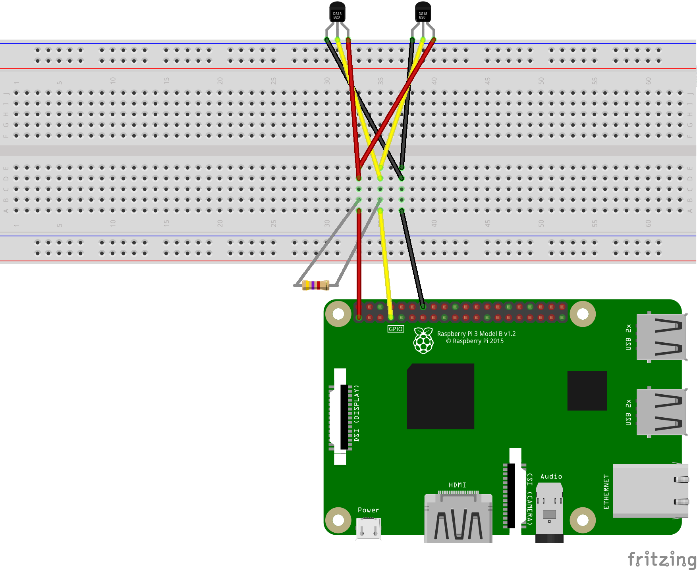

# Fishmon

`fishmon` is a monitoring for my home fish tanks. It runs on a Raspberry Pi
2 Model B connected to a set of DS18B20 temperature probes. Fishmon constantly
takes readings from those probes and uploads them to feeds on Adafruit.IO.

## Usage

### Setting up your Raspberry Pi

Fishmon is only tested on Raspbian systems running on Raspberry Pis.

[Device Tree Overlay documentation]: https://www.raspberrypi.org/documentation/configuration/device-tree.md

On some systems, you will see failures when trying to load the `w1-gpio` and
`w1-therm` kernel modules (if you see an error when you `modprobe w1-gpio`, this
probably affects you). On these systems, you need to first enable the 1-Wire
GPIO device tree overlay: update `/boot/config.txt`, ensuring that the
`dtoverlay=w1-gpio` boot option is set (append this to the end of
`/boot/config.txt`). See the [Device Tree Overlay documentation] for details.

### Connecting your temperature probes

[Adafruit DS18B20 lesson]: https://learn.adafruit.com/adafruits-raspberry-pi-lesson-11-ds18b20-temperature-sensing/hardware

The [Adafruit DS18B20 lesson] is a pretty great tutorial, and should cover 
everything you need. Note that multiple 1-Wire sensors can be connected on the
same data and power connections. For example:



I have 3 temperature probes chained this way.

### Running `fishmon`

Fishmon requires an Adafruit.IO username and API key. To run Fishmon:

```
fishmon -aio_username=YOUR_ADAFRUITIO_USERNAME -aio_key=YOUR_ADAFRUITIO_KEY
```

You can leave `fishmon` after your session exits using standard Linux tricks:

```
nohup fishmon -aio_username=YOUR_ADAFRUITIO_USERNAME -aio_key=YOUR_ADAFRUITIO_KEY &
```

See `fishmon -h` for details.

## Configuration

In order to upload data to Adafruit.IO, `fishmon` needs to know which the right
feed to send data for each probe. This is configured using a JSON file, which
is located by default at `fishmonconfig.json`.

You'll need to create your feeds on Adafruit.IO before you'll have the feed keys
for configuration.

This file contains configuration for each probe:

```js
{
  "version": "1", // For future-proofing.
  "probes": {
    // Each probe is identified by its device file name.
    "28-02089245bf26": {
      "name": "left tank", // This field is just for personal usage to help you
                           // remember which probe this refers to.
      "feed": "fish.left-tank" // The Adafruit.IO feed key for this probe.
    },
    "28-020b924565c7": {
      "name": "shrimp tank",
      "feed": "fish.shrimp-tank"
    }
  }
}

```

See the example file at [`fishmonconfig.example.json`](./fishmonconfig.example.json) for details.

## Developing

Run `make` to build locally. This isn't super useful. There are no current mock
implementations of RPI-specific sensors.

Run `RPI=RASPBERRY_PI_USER@RASPBERRY_PI_HOST make deploy` to deploy. The
deployment script just builds an ARM binary and `scp`'s the binary over.

See [GoDoc](https://godoc.org/github.com/liftM/fishmon) for details.

### Future work

At some point, I would like to set up uptime alerts (so I know when `fishmon`
dies) and temperature alerts (so I know when to take action).
